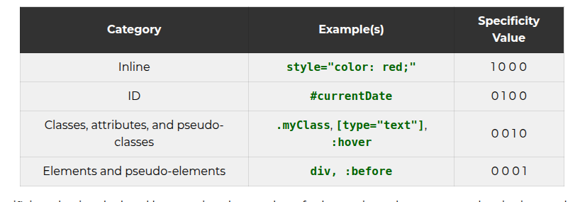

Handling conflicts
https://developer.mozilla.org/en-US/docs/Learn_web_development/Core/Styling_basics/Handling_conflicts

Specificity Calculator
https://specificity.keegan.st/

normalize.css
http://github.com/necolas/normalize.css/blob/master/normalize.css

Specificity
https://developer.mozilla.org/en-US/docs/Web/CSS/CSS_cascade/Specificity

CSS Stats
https://cssstats.com/
